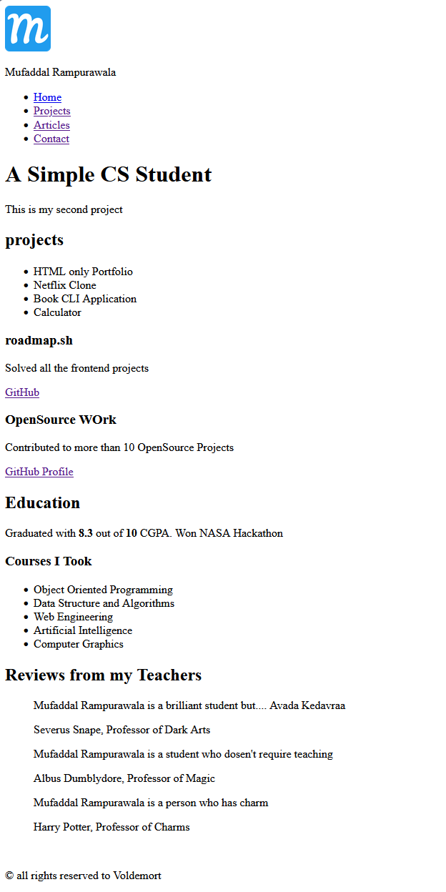

# 🛣️ Roadmap.sh Projects Showcase

Welcome to my repository showcasing projects built as part of the learning paths on [roadmap.sh](https://roadmap.sh/). This repository tracks my progress, code, and live demos for each challenge.

---

## 📂 Table of Contents

- [🎨 Frontend Projects](#-frontend-projects)

---

## 🎨 Frontend Projects

This section contains projects built following the [Roadmap.sh Frontend Developer Path](https://roadmap.sh/frontend/projects).

<table width="100%">
  <!-- Row 1 -->
  <tr>
    <!-- Project 1: Single-Page CV -->
    <td width="50%" align="center" valign="top">
       
      
      <h3>📄 Single-Page CV</h3>
      
A responsive, clean, single-page interactive CV built with semantic HTML and custom CSS styles.

      

        
        &nbsp;
        
      

    </td>
    <!-- Project 2: Basic HTML Website -->
    <td width="50%" align="center" valign="top">
       
      
      <h3> 🌐 Basic HTML Website</h3>
      
A multi-page HTML website focusing on navigation, semantic structure, and content layout.

      

        
        &nbsp;
        
      

    </td>
  </tr>
</table>
